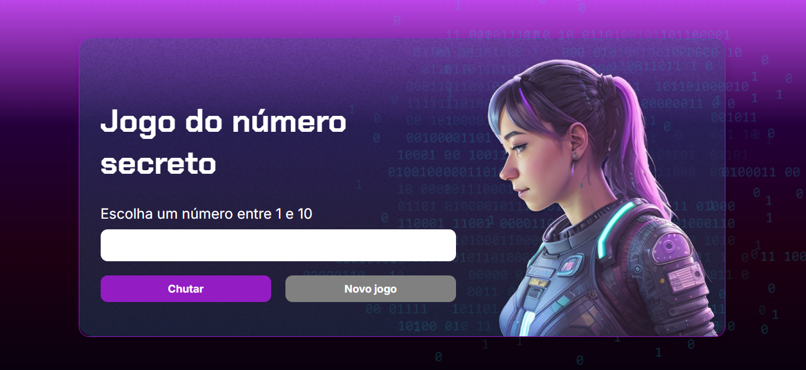

## Project Description

This repository contains the code for a simple and fun game, the "Secret Number Game". The goal of the game is to guess a secret number randomly generated by the computer. The player inputs their guesses, and the game provides hints as to whether the secret number is higher or lower than the guess.

## Tecnologias Utilizadas

* HTML
* CSS
* JavaScript

## Link to Secret Number Game

## Contact

 
 

## Link to Portfolio

